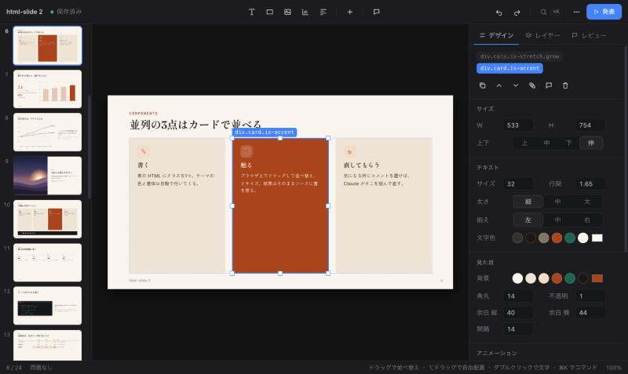

# html-slide 2

HTML slides you can **grab and move**, that **morph** between each other,
and that an agent can **review and fix** in a loop — with no dependencies
beyond Node and an installed Chrome.

A deck is one HTML file. Every slide is a plain `<section class="slide">`;
people, the in-browser editor and Claude all edit that same file, and git
shows exactly what changed.

> Status: alpha. v2 is a from-scratch rewrite and is not compatible with
> v1 decks (`../`). See [Limits](#limits).



## Quick start

```bash
node v2/bin/hs.js new ~/talks/my-talk --theme paper   # self-contained deck
node v2/bin/hs.js dev ~/talks/my-talk                 # http://127.0.0.1:4100/
```

To work on the framework itself, serve this folder and open the template:

```bash
node v2/bin/hs.js dev v2      # http://127.0.0.1:4100/template/
```

## The editor

Opening a deck through `hs dev` starts in the editor (`?present` opens it
presenting; `e` switches).

Slides mix two kinds of element, and each is handled the way it behaves:

- **Flow elements** keep their place in the layout. *Drag* one to reorder
  it or drop it into another container; its *handles* set a size the layout
  then honours.
- **Free elements** (`.free`) sit on the canvas. *Drag* to move, with
  snapping to the canvas, its margins and every other element. Arrows have
  an endpoint handle at each end.
- **⌥-drag** lifts a flow element out into a free one.

| | |
|---|---|
| Click / ⇧-click / drag on empty space | select / add / marquee |
| Double-click | edit text (⌘B, ⌘I, and a format bar on selection) |
| Arrows (⇧ = 10px) | nudge |
| `Esc` / `Enter` / `Tab` | parent / child / next sibling |
| `T` `R` `O` `A` `L` `I` | text, rectangle, ellipse, arrow, line, image |
| ⌘K | command palette (every command, insert, layout, theme, slide) |
| `N` | new slide from the layout gallery |
| `C` | place an `@fix` review note |
| ⌘Z / ⇧⌘Z · ⌘D · ⌘C/X/V | undo / redo · duplicate · clipboard |
| ⌘-wheel · Space-drag · ⌘0 | zoom · pan · fit |
| ⌘↵ | present |

Paste or drop an image and it is saved to `assets/` and placed. The right
panel has three tabs: **Design** (contextual properties; colours are theme
tokens, so they follow a theme change), **Layers** (the slide's tree) and
**Review** (every layout problem and open note in the deck).

Everything is saved to the source about half a second after you stop.
Styles land as inline `style` and classes — the same thing a person or
Claude would write.

## Working with Claude

The editor and an agent can edit the same deck at the same time. Slides are
identified by a hash of their source, and a save only rewrites the slides
that changed, so an outside edit to slide 7 hot-swaps slide 7 in the open
browser without a reload and without touching your work on slide 3.

The review loop:

1. In the editor press `C` and click what bothers you. The note is written
   into the source, directly above that element:

   ```html
   <!-- @fix: legend overlaps the plot; move it top-right -->
   <hs-chart type="line">…</hs-chart>
   ```

2. `hs check <deck>` lists every open note with `file:line`, together with
   what it can measure itself: content off the canvas or in the bottom
   margin, clipped text, text under 18px, contrast under 3:1, broken images.
3. Claude fixes each one, deletes the comment, and looks at the result with
   `hs shot <deck> --slide N`.

Decks made by `hs new` include a `CLAUDE.md` (from `docs/deck-guide.md`)
that teaches this loop and the markup.

## Commands

```
hs dev [dir] [--port 4100]       serve a deck, or a folder of decks, with the editor
hs new <dir> [--theme paper]     scaffold a self-contained deck
hs check <deck> [--json]         audit + open @fix notes; exit 1 on errors
hs shot <deck> [--slide N] [--out shots] [--scale 2]   1920×1080 PNGs
hs pdf <deck> [--out file.pdf]   one page per slide
hs build <deck> [--out dist]     static copy: notes and @fix comments removed
hs build <deck> --single         one self-contained .html (images inlined)
hs notes <deck>                  open @fix notes only (no browser needed)
hs upgrade <deck>                refresh the deck's vendored hs/
```

`check`, `shot` and `pdf` drive an installed Chrome/Chromium/Edge/Brave over
the DevTools protocol (`CHROME_PATH` overrides discovery).

## Presenting

`→`/`Space` next (steps first), `←` back, digits + `Enter` jump, `o`
overview, `p` presenter window (current, next, notes, timer — synced),
`f` fullscreen, `l` laser, `b` blackout, `?` help. Clicking the outer
edges of the screen and swiping also navigate.

Slide changes use the View Transitions API. With the default `morph`,
elements two consecutive slides share — same text, same image, or the same
`data-morph` name — glide to their new position and size, and the rest
cross-fades. Duplicate a slide, move things, and it animates.

## Markup

See [`docs/deck-guide.md`](docs/deck-guide.md) for layouts, tones, steps,
components and charts, and [`template/index.html`](template/index.html)
for one of each.

Themes: `paper` (warm, serif display), `ink` (black/white, one red),
`aurora` (dark, violet/cyan), `lab` (cool, Plex, data-first), `kasumi`
(soft pink, rounded). A theme is a token set plus `invert` and `accent`
tones; copy one in `design/themes/` to make your own.

## How it is put together

```
bin/hs.js          CLI
cli/               server (static + sync endpoints), source model, Chrome/CDP, commands
runtime/           what every deck ships: navigation, steps, transitions, audit,
                   <hs-chart>, <hs-count>, code highlighting, presenter view
design/            tokens, layouts, components, themes
editor/            the editor — injected by the dev server, never referenced by a deck
template/          the starter deck
docs/deck-guide.md the guide copied into new decks as CLAUDE.md
```

Three properties the rest depends on:

- **Runtime state never reaches the source.** It only uses `hs-*` classes
  and `data-hs-*` attributes, which are stripped on save. Charts and
  counters render in a shadow root, and code is coloured with the CSS
  Custom Highlight API, so there is no generated markup to strip.
- **Saves are compare-and-swap.** The browser sends the slide order with
  only the changed slides' markup; the server applies it if the file is
  still at the revision the browser saw, and otherwise returns the new
  state for the browser to merge.
- **The audit is one function.** `HS.audit()` runs in the page; `hs check`
  and the editor's Review tab both report from it.

A deck links `hs/hs.js`, `hs/hs.css` and `hs/themes/<name>.css`. `hs new`
writes those files into the deck (so it works from `file://` and on any
static host); for a deck without them the dev server serves the live
framework from this repository.

## Limits

- Developed against current Chrome. Morph transitions, code colouring and
  phrase-aware Japanese line breaks need recent browser features and fall
  back to a plain cut, uncoloured code and normal wrapping elsewhere.
- No pen tool, no rotation except for arrows, no grouping.
- Changing a slide's layout does not restructure its content (`split`
  wants `.media` + `.text`).
- When the editor touches an element's inline style the browser
  re-serializes that attribute (a hex colour becomes `rgb()`).
- There are no automated tests yet.
